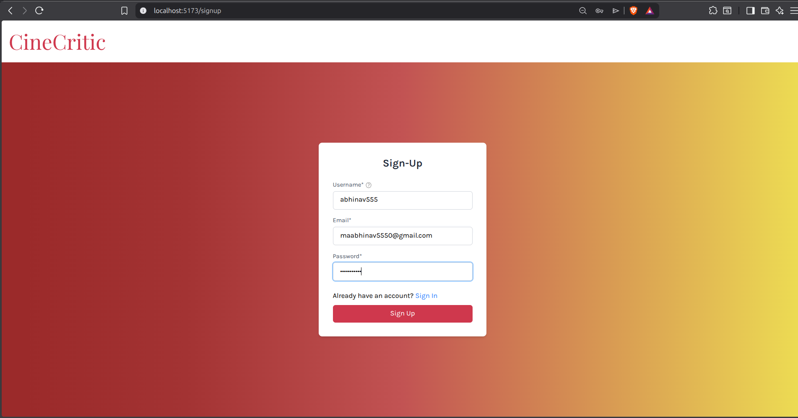
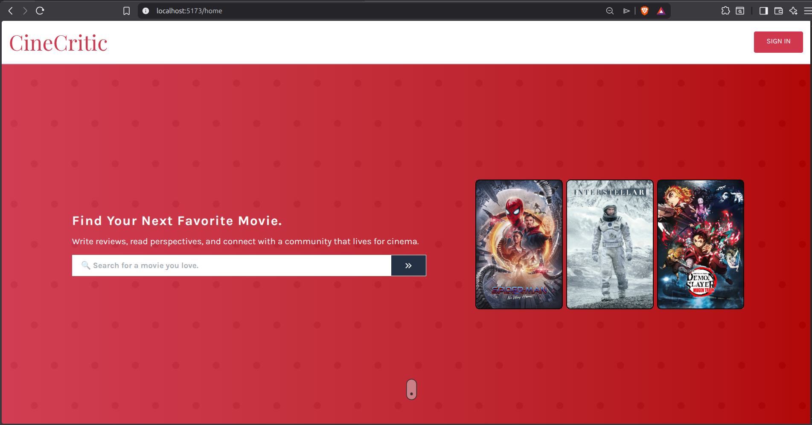
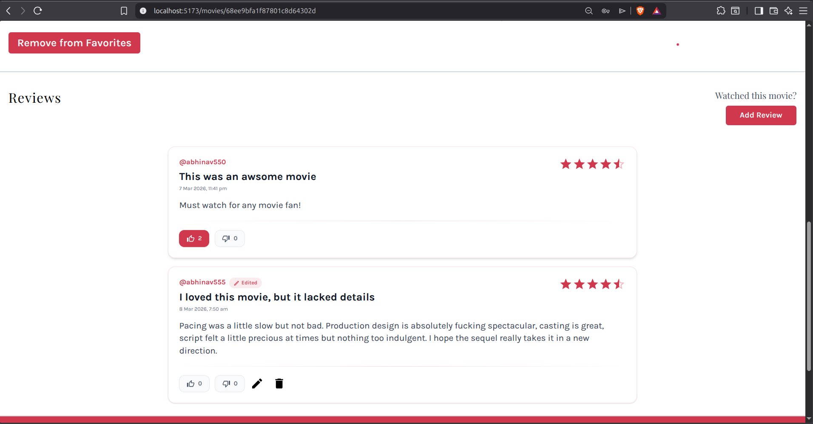
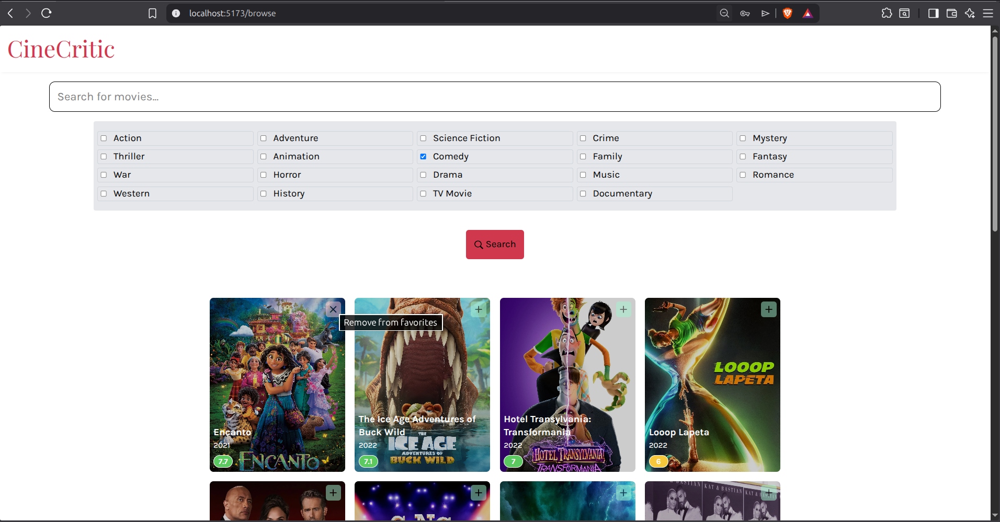
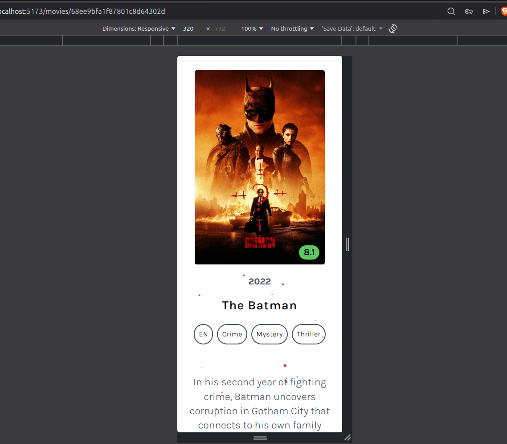

# 🎬 CineCritic – Movie Review Platform

CineCritic is a **full-stack movie discovery and review platform** built with the **MERN Stack**.
It allows users to browse movies, view trending content, write reviews, react to other users’ reviews, and manage their favorite movies.

The platform features **authentication, user profiles, review interactions, and responsive UI**, providing a modern and interactive experience for movie enthusiasts.

---

# 🚀 Features

## 🎥 Movie Discovery

* Browse movies with **genre filtering**
* View **trending movies**
* Paginated movie listings
* Detailed movie information pages

## ⭐ Reviews System

* Create reviews for movies
* Edit or delete your own reviews
* Upvote or downvote other users' reviews
* View reactions on reviews

## ❤️ Favorites System

* Add movies to favorites
* Remove movies from favorites
* View favorite movies in user profile

## 👤 User Authentication

* Secure registration and login
* Session based authentication
* View logged-in user profile
* Logout functionality

## 🔍 Search Functionality

* Search movies by name
* Filter movies by genres

## 📱 Fully Responsive

The application is designed to work smoothly across:

* Desktop
* Tablet
* Mobile devices

---

# 🛠 Tech Stack

## Frontend

* React
* Redux Toolkit
* React Query
* React Router
* TailwindCSS
* Material UI
* Axios
* React Toastify

## Backend

* Node.js
* Express.js
* MongoDB
* Mongoose
* JWT Authentication
* Express Session
* bcrypt

---

# 📂 Project Structure

```
CineCritic
│
├── backend
│   ├── controllers
│   ├── models
│   ├── routes
│   ├── middleware
│   └── utils
│
├── frontend
│   ├── components
│   ├── pages
│   ├── redux
│   ├── api
│   └── utils
│
└── README.md
```

---

# 📸 Screenshots

## 🔐 Authentication



---

## 🏠 Home Page



---

## ✍️ Review Section



---

## 🔎 Search Functionality



---

## 📱 Fully Responsive



---

# 📡 API Routes Overview

## User Routes

### Authentication

```
POST /register
POST /login
POST /logout
GET  /me
```

### User Profile

```
GET /:userId
GET /:userId/favourites
```

---

## Movie Routes

```
GET  /browse
GET  /trending
GET  /:movieId
GET  /
POST /:movieId/favorites
DELETE /:movieId/favorites
```

---

## Review Routes

```
POST   /movies/:movieId/add
GET    /movies/:movieId
GET    /users/:userId
PATCH  /:reviewId/edit
DELETE /:reviewId/delete
POST   /:reviewId/upvote
POST   /:reviewId/downvote
GET    /:reviewId/reactions
```

---

# ⚙️ Installation & Setup

## 1️⃣ Clone the repository

```bash
git clone https://github.com/yourusername/CineCritic.git
cd CineCritic
```

---

## 2️⃣ Backend Setup

```bash
cd backend
npm install
```

Create a `.env` file:

```
MONGO_URI=your_mongodb_connection
JWT_SECRET=your_secret_key
SESSION_SECRET=your_session_secret
```

Run the backend:

```bash
npm run dev
```

---

## 3️⃣ Frontend Setup

```bash
cd frontend
npm install
npm run dev
```

The frontend will run on:

```
http://localhost:5173
```

---

# 📦 Deployment


* **Frontend:** Vercel 
* **Backend:** Render
* **Database:** MongoDB Atlas

---

# 🌟 Future Improvements

* Comment system for reviews
* Review sorting (most helpful / latest)
* Movie recommendations
* Watchlist system
* Social login (Google / GitHub)
* Dark Mode

---

# 🤝 Contributing

Contributions are welcome!

If you'd like to improve CineCritic:

1. Fork the repository
2. Create a feature branch
3. Commit your changes
4. Open a pull request


